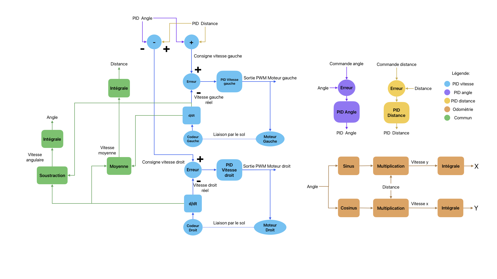

# Code Asservissement (ENSIM'ELEC 2024)
## Introduction
Ce code est créé pour les cartes STM32 NUCLEO-64 F446RE/F411RE. Il gére tous les déplacements et asservissements du robot ainsi que son odométrie. Il a été réalisé via Arduino grâce à la librarie STM32duino installable comme ceci: [STM32duino](https://github.com/stm32duino/Arduino_Core_STM32/wiki/Getting-Started).

Nous avons choisi de la faire sur une carte embarqué car un traitement temps réel est important pour les PID (asservissement), c'est pour cela que nous avons décidé de géré l'intégrité des déplacement sur un MCU. 
Une communication série est utilisé afin de communiqué avec un système externe qui lui donnera des ordres de déplacement.  
En règle général notre code fonctionne via des interruptions.

## Schèma de fonctionnement
 
Notre  système est un asservissement en cascade. En effet, les asservissement d'angle et de déplacement contrôlent les asservissemnts de vitesse qui eux même contrôlent la vitesse des moteurs. Le but est de pouvoir indiqué un angle et une distance que ces asservissement vont essayer de garder. Par exemple si le robot parcour une distance trop élevé il retourne en arrière pour rester sur sa bonne position. L'asservissement vitesse permet d'obtenir une vitesse similaire entre les deux moteur. En effet, si un moteur doit supporter une charge plus grande que l'autre, sa consigne doit donc être plus élevé pour que leur vitesse réel soit identique. 
Au niveau de l'odométrie les calculs sont assez simple, pour obtenir des coordonées polaire. la distance parcourue par chaque roue est obtenue par les roues codeuse.

## Encodeurs 
(réf: Bourns ENS1J-B28-L002 )  
Les encodeurs utilisé sont des encodeurs de quadratures. Ce type d'encodeur requiert sur un système classique des interruptions afin de compter le nombre de tick sur chaque roues ([petit tuto sur arudino](https://www.locoduino.org/spip.php?article82) pour mieux comprendre).
Cependant dans notre cas pour optimiser le systèmes au lieu d'utiliser des interruptions, nous avons délégué cette tâche au TIMER, d'ou l'importance que les encodeurs soit de quadratures.  

**ATTENTION**   
lors de la coupe nous avons rencontré un problème avec le débordement du TIMER ce cas n'avait malheuresmsent pas été étudié. Il a été néanmmoins partiellement réglé afin de rendre le robot fonctionelle mais à améliorer.

## PID
Les 

## Comunication Série
La liason série fonctionne avec un cable USB et elle est défini à 115200 bauds. Elle fonctionne via l'interruption sur la liason série.  

**ATTENTION**  
nous avons eu plusieurs problèmes de transimissions et de vitesse de transmission avec la liaison USB série. Je vous conseille d'essayer la liasons série via les I/O qui devrait être plus fiable qu'avec un cable USB. Il faudra donc revoir l'électronique.

#### Exemple de commandes
```plaintext
asserv debug [enable|disable]
asserv recalage [1|0]
asserv [enable|disable|reset] [all|angle|distance]
asserv [enable|disable|reset] vitesse [all|gauche|droite]
asserv set coord [x] [y]
asserv set angle [angle]
asserv set position [x] [y] [angle]
asserv goto [x] [y] [speed]
asserv rotate [angle]
asserv moveof [distance] [speed]
asserv stopmove
asserv restartmove
```